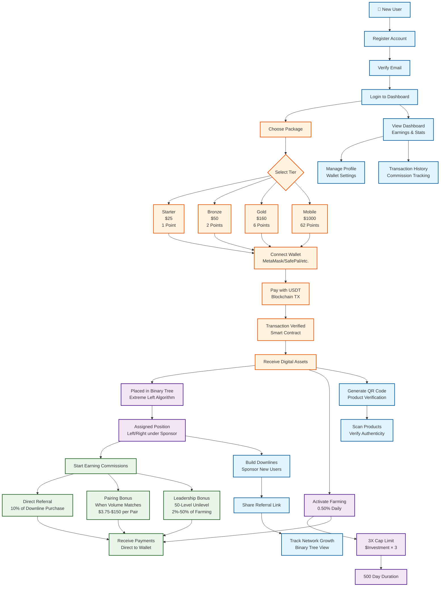
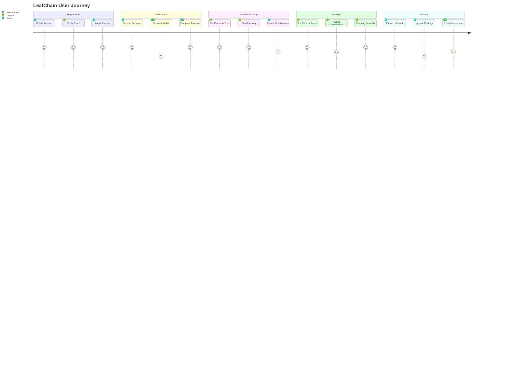

# LeafChain User Journey & System Overview

## User Actions & System Flow Diagram

## Detailed User Capabilities & System Features

### 👤 **User Profile Management**
- **Account Settings**: Email, password, profile photo
- **Wallet Integration**: MetaMask, Trust Wallet, SafePal, TokenPocket
- **Security**: 2FA, password reset, session management
- **Verification**: Email verification, KYC compliance

### 💰 **Package Investment System**
| Package | Price | Binary Points | Buy Basket | Farming Allocation | Max Daily Pairs |
|---------|-------|---------------|------------|-------------------|-----------------|
| Starter | $25 | 1 | $10 (40%) | $15 (60%) | 12 |
| Bronze | $50 | 2 | $20 (40%) | $30 (60%) | 18 |
| Gold | $160 | 6 | $48 (30%) | $112 (70%) | 36 |
| Mobile | $1000 | 62 | $200 (20%) | $800 (80%) | 96 |

### 🌳 **Binary Network System**
- **Placement Algorithm**: Extreme left strategy
- **Tree Visualization**: Interactive zoom/pan controls
- **Network Analytics**: Volume tracking, balance ratios
- **Downline Management**: Direct referrals table

### 💎 **Commission Structure**
1. **Direct Referral**: 10% of downline's package purchase
2. **Pairing Bonus**: Fixed amounts when left/right volumes match
3. **Leadership Bonus**: Unilevel commissions (50 levels, 1%-50%)

### 🌾 **DeFi Farming System**
- **Daily Rate**: 0.50% compounded daily
- **Duration**: Up to 500 days
- **ROI Cap**: 300% maximum return
- **Auto-Harvest**: Daily rewards credited automatically

### 🔐 **Security & Verification**
- **Blockchain Verification**: Transaction hash validation
- **QR Code System**: Product authenticity verification
- **Wallet Security**: Non-custodial asset management
- **Transaction History**: Complete audit trail

### 📊 **Analytics & Reporting**
- **Dashboard Metrics**: Total earnings, network size, active members
- **Transaction History**: All commissions and purchases
- **Performance Tracking**: Farming progress, bonus achievements
- **Network Visualization**: Interactive binary tree view

### 🎯 **User Goals & Benefits**
- **Financial Growth**: Multiple income streams (commissions + farming)
- **Network Building**: Recruit and sponsor new members
- **Asset Ownership**: Digital tokens and physical products
- **Community Participation**: DAO governance (future feature)

---

## Key User Journey Milestones

This diagram provides a comprehensive overview of the LeafChain user experience, from initial registration through network building and ongoing earnings generation.